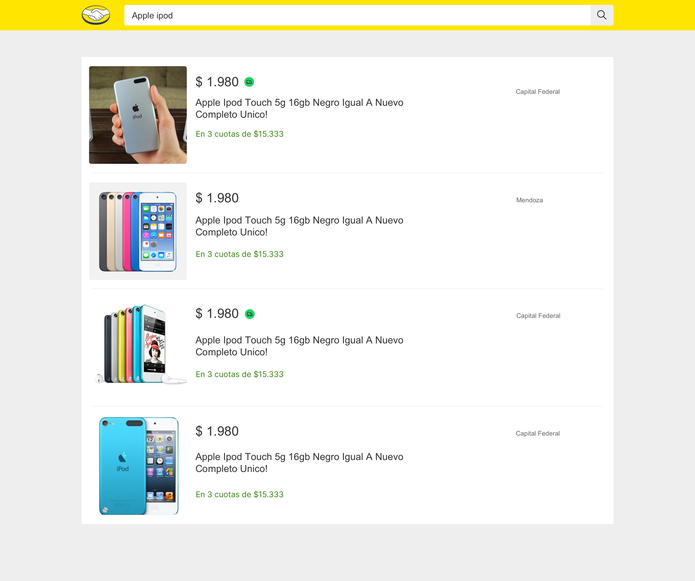
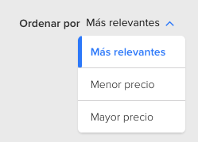
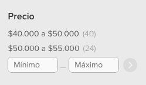

# Meli Challenge ([Versão PT](./README_pt.md))

Hola,
Ante todo, gracias por tu tiempo. A continuación te contaremos de que se trata el desafio.
Tu objetivo es crear un buscador de productos de Mercado Libre. Dentro del directorio `app`, encontrarás un proyecto en [Next.js](https://nextjs.org/), donde tendrás que desarrollar tu solución. El ejercicio envuelve una serie de iteraciones; intenta completar cada interación antes de leer la próxima.

&nbsp;

### Entregable

Este repositorio es un [Template Repository](https://docs.github.com/en/repositories/creating-and-managing-repositories/creating-a-repository-from-a-template), y debes crear tu proyecto en base a este template. Ten en cuenta los siguientes puntos:
- Tu usuario debe ser el **owner**
- Cuando uses el template, selecciona la opción `Include all branches` para descargar todos los branches del repo
- Una vez creado el repo privado desde el templace, deberás usar los archivos que están en la rama `cx-challenge-v2`
- El repositorio debe tener visibilidad `privada`
- Una vez que finalices y nos compartas el challenge, te enviaremos los usuarios que van a revisar tu entregable para que los agregues

### Requerimientos técnicos

- El proyecto debe ser reponsive para los siguientes tamaños del pantalla 320, 768, 1280px.
- Crear Unit Tests donde sea necesario, concéntrate en las funciones de desafío.
- Usar Typescript.

Vamos a prestar atención sobre todo a los siguientes puntos:
- Diseño orientado a objetos.
- Diseño testeable.
- Arquitectura modular.
- Código legible y que revele su intención.
- Extensibilidad.
- Principios SOLID aplicados de manera criteriosa.
- Atención a los detalles.

Cosas que pueden ayudar a tu proyecto pero **no son obligatorias**:
- Commit semántico con o sin una herramienta o libraria.
- Aplicacion de Server Side Render.
- Accesibilidad de los componentes.
- HTML semantic.
- Patrones CSS.
- Seo.
- Integration Tests.


Comencemos...

---

&nbsp;

## Iteración 1: Agregar la funcionalidad buscador de productos
### Feature: Buscador de productos

    Como usuario de Mercado Libre
    Quiero buscar productos en base a una palabra o parte de ella
    Para poder comparar y elegir el producto que más me convenga

    Scenario: Un usuario anonimo busca un producto en Mercado Libre
        Dado un usuario anonimo
        Cuando ingresa un texto en el buscador
        Entonces el sistema retorna una lista de productos que contengan el texto, o parte de él, en el título

&nbsp;

### Diseño



&nbsp;

### Especificaciones técnicas:
- Crear un store global utilizando [context api](https://reactjs.org/docs/context.html). El mismo debe controlar el listado de productos.
- Para construir el componente de resultado de búsqueda, deberás consumir el siguiente servicio: https://api.mercadolibre.com/sites/MLA/search?q={TEXT_TO_SEARCH}&limit=10.
- El componente deberá cumplir con el siguiente contrato:
```javascript
Interface Product {
    id: string;
    title: string;
    price: {
        currency: string;
        amount: string;
        decimals: number;
    };
    installments: {
        quantity: number;
        amount: string;
    };
    address: {
        state_name: string;
        city_name: string;
    };
    picture: string;
    condition: string;
    free_shipping: boolean;
}
```

---

&nbsp;

## Iteración 2: Agregar funcionalidad ordenado de productos
Feature: Ordenar productos

    Como usuario de Mercado Libre
    Quiero ordenar el resultado de búsqueda en base a un criterio
    Para poder comparar y elegir el producto que más me convenga

    Scenario: Un usuario anonimo ordena el resultado de búsqueda en Mercado Libre
        Dado un usuario anonimo
        Cuando selecciona un criterio de ordenamiento
        Entonces el sistema retorna una lista de productos ordenado por el criterio seleccionado

&nbsp;

### Diseño

(Ubica el componente donde consideres adecuado para la lectura y experiencia del usuario. Ten en cuenta el orden de los componentes y el comportamiento responsivo)



&nbsp;

### Especificaciones técnicas:
- Para construir el componente de ordenamiento, deberás consultar el atributo `available_sorts` en la respuesta de la API. El mismo retorna los posibles parametros de ordemamiento.

```javascript
 "available_sorts": [
    {
      "id": "relevance",
      "name": "Más relevantes"
    },
    {
      "id": "price_desc",
      "name": "Mayor precio"
    }
],
```

- Para aplicar un ordemiento a la búsqueda de productos, deberás agregar el paramentro `sort={SORT_ID}` a la url, ej: https://api.mercadolibre.com/sites/MLA/search?q={TEXT_TO_SEARCH}&sort=price_desc&limit=10


---

&nbsp;

## Iteración 3: Agregar funcionalidad filtro de precio
Feature: Fitrar búsqueda por precio

    Como usuario de Mercado Libre
    Quiero filtrar el resultado de búsqueda por un rango de precio
    Para poder comparar y elegir el producto que más me convenga

    Scenario: Un usuario anonimo aplica un filtro de precio al resultado de búsqueda en Mercado Libre
        Dado un usuario anonimo
        Cuando aplica el filtro de búsqueda
        Entonces el sistema retorna una lista de productos filtrados por el rango de precio seleccionado

&nbsp;

### Diseño

(Ubica el componente donde consideres adecuado para la lectura y experiencia del usuario. Ten en cuenta el orden de los componentes y el comportamiento responsivo)



&nbsp;

### Especificaciones técnicas:
- Para construir el componente de filtro de precio, deberás consultar el atributo `available_filters` en la respuesta de la API. El mismo retorna un listado de filtros; dentro de él encontrarás un objeto con los parametros de filtro de precio.

```javascript
"available_filters": [
    {},
    {},
    {
      "id": "price",
      "name": "Precio",
      "type": "range",
      "values": [
        {
          "id": "*-3000.0",
          "name": "Hasta $ 3.000",
          "results": 639
        },
        {
          "id": "3000.0-9500.0",
          "name": "$3.000 a $9.500",
          "results": 669
        },
        {
          "id": "9500.0-40000.0",
          "name": "$9.500 a $40.000",
          "results": 687
        }
      ]
    },
    ...
]
```
- Para aplicar un filtro a la búsqueda de productos, deberás agregar el paramentro `{FILTER_ID}={VALUE_ID}` a la url, ej: https://api.mercadolibre.com/sites/MLA/search?q={TEXT_TO_SEARCH}&sort={SORT_ID}&price=3000.0-9500.0&limit=10.

- También puedes agregar un rango numérico personalizado. Para ello debes agregar los valores separados por "-" y sin separador de miles ej: `price=1000.0-1030.0`


---

&nbsp;

## Iteración 4: Mejorar el control de estado
Improvement: Es necesario migrar el control de estado de **CONTEXT-API** a [**REDUX TOOLKIT**](https://redux-toolkit.js.org/)


