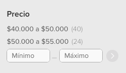

# Meli Challenge ([Versión ES](./README.md))

Olá,
Primeiramente, obrigado pelo seu tempo. A seguir, explicaremos sobre o desafio.
Seu objetivo é criar um buscador de produtos do Mercado Livre. Dentro do diretório `app` encontrará um projeto em [Next.js](https://nextjs.org/), onde você terá que desenvolver sua solução. O exercício consiste em uma série de iterações; tente completar cada iteração antes de avançar para a próxima.

&nbsp;

### Entregável

Este repositório é um [Template] (https://docs.github.com/en/repositories/creating-and-managing-repositories/creating-a-repository-from-a-template), e você deve criar seu projeto com base neste template. Leve em consideração os seguintes pontos:

- Seu usuário deve ser o **proprietário**
- Ao usar o modelo, selecione a opção `Incluir todas as branches` para fazer download de todas as branches do repositório.
- Depois de criar o repositório privado a partir do templace, você deve usar os arquivos na branch `cx-challenge-v2`.
- Se não especificarem uma branch, você deve usar os arquivos que estão na `master`
- O repositório deve ser `privado`
- Depois que terminar e compartilhar o desafio conosco, enviaremos os usuários que revisarão sua entrega para que você os adicione.

### Requisitos Técnicos

- O projeto deve ser responsivo para as seguintes larguras de tela: 320px, 768px e 1280px.
- Criar testes unitários onde for necessário, concentrando-se nas funções do desafio.
- Usar Typescript.

São **desejáveis** os seguintes pontos:
- Design orientado a objetos;
- Design testável;
- Arquitetura modular;
- Código legível que revele sua intenção;
- Extensibilidade;
- Princípios SOLID aplicados de maneira criteriosa;
- Atenção aos detalhes.

Desejáveis mas **não obrigatórios**:
- Commit semântico com ou sem uma ferramenta ou biblioteca;
- Aplicação de Server Side Render;
- Acessibilidade;
- HTML semântico;
- Padrões CSS;
- SEO;
- Testes de integração.

Vamos começar...

---

&nbsp;

## Iteração 1: Adicionar a funcionalidade de buscador de produtos
### Feature: Buscador de produtos

    Como usuário do Mercado Livre
    Eu quero buscar produtos com base em uma palavra ou parte dela
    Para que eu possa comparar e escolher o produto que mais me convém

    Cenário: Um usuário anônimo busca um produto no Mercado Livre
        Dado um usuário anônimo
        Quando ele digita um texto na barra de pesquisa
        Então o sistema retorna uma lista de produtos que contenham o texto, ou parte dele, no título.

&nbsp;

### Design


&nbsp;

### Especificações técnicas:
- Criar uma store global com [Context Api](https://reactjs.org/docs/context.html), para controlar a lista de produtos.

- Para criar o componente com o resultado da pesquisa, você precisará consumir o seguinte serviço: https://api.mercadolibre.com/sites/MLA/search?q={TEXT_TO_SEARCH}&limit=10.
- Este deverá cumprir o seguinte contrato:

```javascript
Interface Product {
    id: string;
    title: string;
    price: {
        currency: string;
        amount: string;
        decimals: number;
    };
    installments: {
        quantity: number;
        amount: string;
    };
    address: {
        state_name: string;
        city_name: string;
    };
    picture: string;
    condition: string;
    free_shipping: boolean;
}
```

---

&nbsp;

## Iteração 2: Adicionar a funcionalidade de ordenação de produtos

### Feature: Ordenar produtos

    Como usuário do Mercado Livre
    Quero ordenar o resultado da pesquisa com base em um critério
    Para poder comparar e escolher o produto que mais me convém

    Cenário: Um usuário anônimo ordena o resultado da pesquisa no Mercado Livre
      Dado um usuário anônimo
      Quando seleciona um critério de ordenação
      Então o sistema retorna uma lista de produtos ordenado pelo critério selecionado

&nbsp;

### Design

(Coloque o componente onde você considerar adequado para a leitura e experiência do usuário. Tenha em mente a ordem dos componentes e o comportamento responsivo)


&nbsp;

### Especificações Técnicas:

- Para construir o componente de ordenação, você deve consultar o atributo available_sorts na resposta da API. Ele retorna os possíveis parâmetros de ordenação.

```javascript
 "available_sorts": [
    {
      "id": "relevance",
      "name": "Más relevantes"
    },
    {
      "id": "price_desc",
      "name": "Mayor precio"
    }
],
```

- Para aplicar uma ordenação à busca de produtos, você deve adicionar o parâmetro `sort={SORT_ID}` à URL, por exemplo: https://api.mercadolibre.com/sites/MLA/search?q={TEXT_TO_SEARCH}&sort=price_desc&limit=10


---

&nbsp;

## Iteração 3: Adicionar a funcionalidade de filtro por preço

Feature: Filtrar busca com filtro por preço

    Como usuário do Mercado Livre
    Quero filtrar o resultado da pesquisa por uma faixa de preço
    Para poder comparar e escolher o produto que mais me convém

    Cenário: Um usuário anônimo aplica um filtro de preço ao resultado da pesquisa no Mercado Livre
      Dado um usuário anônimo
      Quando aplica o filtro de pesquisa
      Então o sistema retorna uma lista de produtos filtrados pela faixa de preço selecionada.


&nbsp;

### Design

(Coloque o componente onde você considerar adequado para a leitura e experiência do usuário. Tenha em mente a ordem dos componentes e o comportamento responsivo)



&nbsp;

### Especificações técnicas:
- Para construir o componente de filtro de preço, você precisará consultar o atributo `available_filters` na resposta da API. Retorna uma lista de filtros; dentro dele você encontrará um objeto com os parâmetros do filtro de preços.

```javascript
"available_filters": [
    {},
    {},
    {
      "id": "price",
      "name": "Precio",
      "type": "range",
      "values": [
        {
          "id": "*-3000.0",
          "name": "Hasta $ 3.000",
          "results": 639
        },
        {
          "id": "3000.0-9500.0",
          "name": "$3.000 a $9.500",
          "results": 669
        },
        {
          "id": "9500.0-40000.0",
          "name": "$9.500 a $40.000",
          "results": 687
        }
      ]
    },
    ...
]
```
- Para aplicar um filtro à pesquisa de produtos, você deve adicionar o parâmetro `{FILTER_ID}={VALUE_ID}` à URL, exemplo: https://api.mercadolibre.com/sites/MLA/search?q={TEXT_TO_SEARCH}&sort={SORT_ID}&price=3000.0-9500.0&limit=10

- Também é possível adicionar um intervalo numérico personalizado. Para isso, você deve adicionar os valores separados por "-" e sem separador de milhares. Exemplo: `price=1000.0-1030.0`


---

&nbsp;

## Iteração 4: Melhorar o controle de estados
Melhoria: É necessário migrar o controle de estado de **CONTEXT API** para [**REDUX TOOLKIT**](https://redux-toolkit.js.org/)


